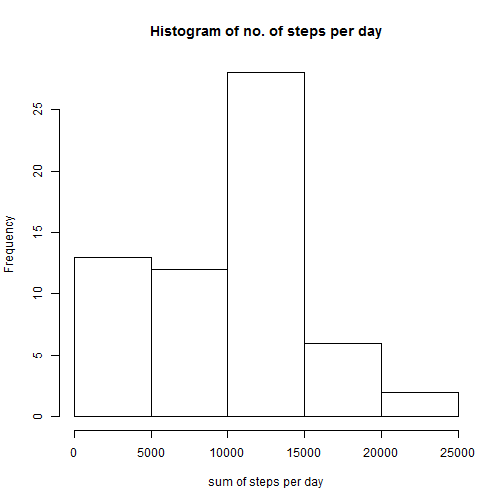
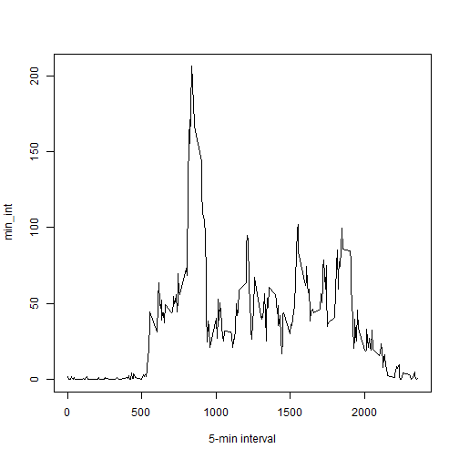
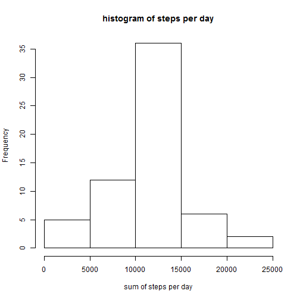

This is an R Markdown document. Markdown is a simple formatting syntax for authoring HTML, PDF, and MS Word documents. For more details on using R Markdown see <http://rmarkdown.rstudio.com>.

When you click the **Knit** button a document will be generated that includes both content as well as the output of any embedded R code chunks within the document. You can embed an R code chunk like this:

## Introduction

It is now possible to collect a large amount of data about personal
movement using activity monitoring devices such as a
[Fitbit](http://www.fitbit.com), [Nike
Fuelband](http://www.nike.com/us/en_us/c/nikeplus-fuelband), or
[Jawbone Up](https://jawbone.com/up). These type of devices are part of
the "quantified self" movement -- a group of enthusiasts who take
measurements about themselves regularly to improve their health, to
find patterns in their behavior, or because they are tech geeks. But
these data remain under-utilized both because the raw data are hard to
obtain and there is a lack of statistical methods and software for
processing and interpreting the data.

This assignment makes use of data from a personal activity monitoring
device. This device collects data at 5 minute intervals through out the
day. The data consists of two months of data from an anonymous
individual collected during the months of October and November, 2012
and include the number of steps taken in 5 minute intervals each day.

## Data

The data for this assignment can be downloaded from the course web
site:

* Dataset: [Activity monitoring data](https://d396qusza40orc.cloudfront.net/repdata%2Fdata%2Factivity.zip) [52K]

The variables included in this dataset are:

* **steps**: Number of steps taking in a 5-minute interval (missing
    values are coded as `NA`)

* **date**: The date on which the measurement was taken in YYYY-MM-DD
    format

* **interval**: Identifier for the 5-minute interval in which
    measurement was taken


The dataset is stored in a comma-separated-value (CSV) file and there
are a total of 17,568 observations in this
dataset.

## Loading and processing the data

Load the data:


```r
echo = TRUE
setwd("C:/Users/Kelvin Lin/datasciencecoursera")
activity <- read.csv("activity.csv")
```

## What is the mean total number of steps taken each day?

Sum total nuber of steps for every single date:


```r
total <- tapply(activity$steps, activity$date, sum, na.rm=T)
```

Plot histogram of the total number of steps taken each day


```r
hist(total, xlab = "sum of steps per day", main = "Histogram of no. of steps per day" )
```

 

Calculate mean and median of the total number of steps taken each day:


```r
mean_total <- round(mean(total))
print(c("The mean is", mean_total))
```

```
## [1] "The mean is" "9354"
```

```r
median_total <- round(median(total))
print(c("The median is", median_total))
```

```
## [1] "The median is" "10395"
```

## What is the average daily activity pattern?

A time series plot of the 5-minute interval and the average number of steps taken is show below:


```r
min_int <- tapply(activity$steps, activity$interval, mean, na.rm=T)
plot(min_int ~ unique(activity$interval), type="l", xlab = "5-min interval")
```

 

The 5 min interval that contains the maximum number of steps is:


```r
min_int[which.max(min_int)]
```

```
##      835 
## 206.1698
```

## Inputing missing values

Note that there are a number of days/intervals where there are missing values (coded as NA). The presence of missing days may introduce bias into some calculations or summaries of the data.

To visualise where the number of NAs are:


```r
table(is.na(activity) == TRUE)
```

```
## 
## FALSE  TRUE 
## 50400  2304
```

```r
summary(activity)
```

```
##      steps                date          interval     
##  Min.   :  0.00   2012-10-01:  288   Min.   :   0.0  
##  1st Qu.:  0.00   2012-10-02:  288   1st Qu.: 588.8  
##  Median :  0.00   2012-10-03:  288   Median :1177.5  
##  Mean   : 37.38   2012-10-04:  288   Mean   :1177.5  
##  3rd Qu.: 12.00   2012-10-05:  288   3rd Qu.:1766.2  
##  Max.   :806.00   2012-10-06:  288   Max.   :2355.0  
##  NA's   :2304     (Other)   :15840
```

All of the 2304 NAs are in the steps variable.

## Strategy to fill in all of the missing values in the dataset

The following strategy is chosen: for any NA value in the step variable, the mean ( number of steps) of the corresponding interval is taken as the replacing value.

The 'min_int' contains the mean for each single interval calculated over the 61 days. The right value coming from 'min_int' is going to be used to replace the NA at the same interval.

Create a new dataset that will have the NA values replaced by the mean.


```r
activity2 <- activity  # creation of the dataset that will have no more NAs
for (i in 1:nrow(activity)){
    if(is.na(activity$steps[i])){
        activity2$steps[i]<- min_int[[as.character(activity[i, "interval"])]]
    }
}
```

The histogram of the total number of steps taken each day (for new datase) is shown below:


```r
total2 <- tapply(activity2$steps, activity2$date, sum, na.rm=T)
hist(total2, xlab = "sum of steps per day", main = "histogram of steps per day")
```

 

Mean and median values of the new dataset are shown below


```r
mean_total2 <- round(mean(total2))
print(c("The mean is", mean_total2))
```

```
## [1] "The mean is" "10766"
```

```r
median_total2 <- round(median(total2))
print(c("The median is", median_total2))
```

```
## [1] "The median is" "10766"
```

In order to compare the mean and median values of the old and new dataset:


```r
df_summary <- rbind(data.frame(mean = c(mean_total, mean_total2), median = c(median_total, median_total2)))
rownames(df_summary) <- c("Old (with NAs)", "New (w/o NAs)")
df_summary
```

```
##                 mean median
## Old (with NAs)  9354  10395
## New (w/o NAs)  10766  10766
```

Impact of inputing the missing data on the estimates of the total daily number of steps


```r
summary(activity2)
```

```
##      steps                date          interval     
##  Min.   :  0.00   2012-10-01:  288   Min.   :   0.0  
##  1st Qu.:  0.00   2012-10-02:  288   1st Qu.: 588.8  
##  Median :  0.00   2012-10-03:  288   Median :1177.5  
##  Mean   : 37.38   2012-10-04:  288   Mean   :1177.5  
##  3rd Qu.: 27.00   2012-10-05:  288   3rd Qu.:1766.2  
##  Max.   :806.00   2012-10-06:  288   Max.   :2355.0  
##                   (Other)   :15840
```

```r
summary(activity)
```

```
##      steps                date          interval     
##  Min.   :  0.00   2012-10-01:  288   Min.   :   0.0  
##  1st Qu.:  0.00   2012-10-02:  288   1st Qu.: 588.8  
##  Median :  0.00   2012-10-03:  288   Median :1177.5  
##  Mean   : 37.38   2012-10-04:  288   Mean   :1177.5  
##  3rd Qu.: 12.00   2012-10-05:  288   3rd Qu.:1766.2  
##  Max.   :806.00   2012-10-06:  288   Max.   :2355.0  
##  NA's   :2304     (Other)   :15840
```

There are no more NAs.

## Are there differences in activity patterns between weekdays and weekends?

### 1. Create a new factor variable in the dataset with two levels -- "weekday" and "weekend" indicating whether a given date is a weekday or weekend day.

Add 2 new columns to the data frame, col weekday_1 converting the date into the correspoding day of the week and col weekday containing the factor "weekend" or "weekday"


```r
activity2$date <- as.Date(activity2$date, format= "%Y-%m-%d")
activity2$weekday_1 <- weekdays(activity2$date)
for (i in 1:nrow(activity2)){
    if(activity2$weekday_1[i] == "Sunday" | activity2$weekday_1[i] == "Saturday"){
        activity2$weekday[i]<- "weekend"
    } else {

    activity2$weekday[i]<- "weekday"
    }
}
```

To remove col activity2$weekday_1


```r
activity2$weekday_1 <- NULL
```

### 2. Make a panel plot containing a time series plot (i.e. type = "l") of the 5-minute interval (x-axis) and the average number of steps taken, averaged across all weekday days or weekend days (y-axis). 

Subset data for weekends and weekends, and aggregate data based on mean steps taken for each interval


```r
activity2_weekend <- subset(activity2, activity2$weekday == "weekend")
activity2_weekday <- subset(activity2, activity2$weekday == "weekday")

mean_activity2_weekday <- tapply(activity2_weekday$steps, activity2_weekday$interval, mean)
mean_activity2_weekend <- tapply(activity2_weekend$steps, activity2_weekend$interval, mean)
```

Use Lattice to plot graph


```r
library(lattice)
df_weekday <- NULL
df_weekend <- NULL
df_final <- NULL
df_weekday <- data.frame(interval = unique(activity2_weekday$interval), avg = as.numeric(mean_activity2_weekday), day = rep("weekday", length(mean_activity2_weekday)))
df_weekend <- data.frame(interval = unique(activity2_weekend$interval), avg = as.numeric(mean_activity2_weekend), day = rep("weekend", length(mean_activity2_weekend)))
df_final <- rbind(df_weekday, df_weekend)
xyplot(avg ~ interval | day, data = df_final, layout = c(1, 2), type = "l", ylab = "Number of Steps")
```

 
